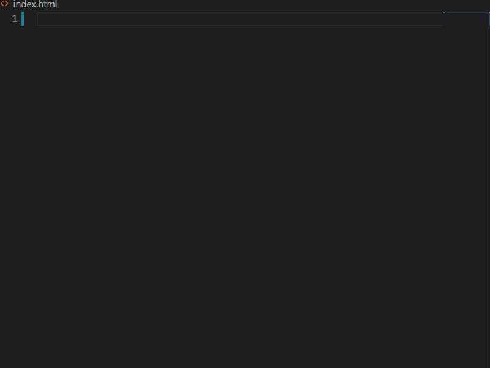
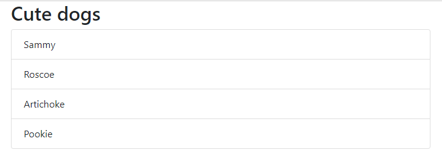

# Creating a starting project

We're going to start with a core HTML/CSS/JavaScript project. You can use whatever JavaScript framework you might like with [Azure Static Web Apps](https://docs.microsoft.com/azure/static-web-apps/overview). To avoid any prerequisite framework knowledge we're going to use [Bootstrap](https://getbootstrap.com) for our user interface and [Vanilla JS](https://learnvanillajs.com/).

## Creating the starter project

- Create a new folder named **aswa-workshop** and open it in Visual Studio Code

``` bash
mkdir aswa-workshop
cd aswa-workshop
code .
```

## Setup the HTML page

### Create the page

- In Visual Studio Code create a new HTML file named **index.html**
- Using the [Bootstrap snippets extension](https://marketplace.visualstudio.com/items?itemName=thekalinga.bootstrap4-vscode)
- Type `b4-$`, ensure the snippet is selected, and hit enter to create the necessary HTML



- Set the `<title>` to **ASWA dogs**.

``` html
<title>ASWA dogs</title>
```

### Add the core display elements

- Just below `<body>` add the following code

``` html
<!-- snip --->
<body>
    <article class="container">
        <ul class="list-group" id="dogs-list">
        </ul>
    </article>
<!-- snip --->
```

This will add a [Bootstrap container](https://getbootstrap.com/docs/4.5/layout/overview/#containers) and a [list group](https://getbootstrap.com/docs/4.5/components/list-group/). You've also set the `id` of the list to **dogs-list**, which will use to display the list of dogs.

### Add a reference to a script file

In just a little bit we're going to create a JavaScript file. To make our lives a little easier, we're going to add the reference to the HTML file now. Down towards the bottom of the file, right below the closing `</body>` tag, add the following HTML to reference the script.

``` html
<!-- snip -->
    <script src="local-index.js"></script>
    </body>
</html>
```

> **NOTE:** Typically we'd call this **index.js**. We're naming it **local-index.js** because there will be another **index.js** in our project, and this will help avoid confusion.

## Create the client-side JavaScript

### Create the file

- In Visual Studio Code, create a new file named **local-index.js**.
- Add an array to store a set of JavaScript objects we'll use as our list of dogs

``` javascript
const dogs = [
    { name: 'Sammy' },
    { name: 'Roscoe' },
    { name: 'Artichoke' },
    { name: 'Pookie' },
]
```

### Create a function for adding items to the UI

- Add the following JavaScript to display the list of dogs

``` javascript
function displayDogs() {
    for (let dog of dogs) {
        const dogUI = document.createElement('li');
        dogUI.className = 'list-group-item';
        dogUI.innerText = dog.name;

        document.getElementById('dogs-list').appendChild(dogUI);
    }
}
```

This will display all items in the array on the page. For each item we create a new `li`, set the class to be `list-group-item` (for pretty Bootstrap display), and set the text to be the name of the dog.

### Create a main function and call it

We will eventually need [async/await](https://developer.mozilla.org/docs/Web/JavaScript/Reference/Statements/async_function) as part of our demo. To make our [refactoring](https://www.refactoring.com/) a little easier, we're going to put in the infrastructure we'll need now.

- Create a new `async` function called `main`, call `displayDogs`, and then call `main`

``` javascript
// at the bottom of the file
async function main() {
    displayDogs();
}

main();
```

## Test our page

- **Save all files**
- In Visual Studio Code, press Ctl-Shift-P (or Cmd-Shift-P) to open the [Command Palette](https://code.visualstudio.com/docs/getstarted/userinterface#_command-palette)
- Type and select **Live Server: Open with Live Server**
 
This will create a local host for your page on port 5500.

- Open a browser and navigate to http://localhost:5500

You should now see the display!



## Next steps

Now let's [push out to GitHub so we can eventually deploy it to Azure](./2-github.md).
