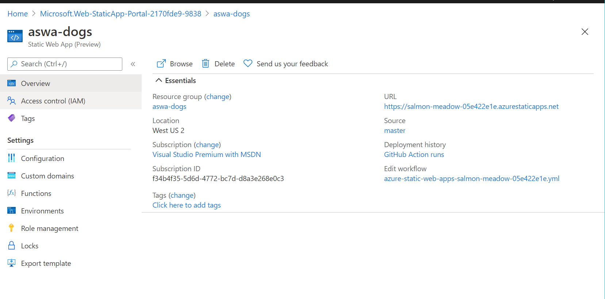

# Create Azure Static Web App

With our code now on GitHub we can create our static web app. We'll be configuring a handful of options along the way. What will happen behind the scenes is this creation will create a [GitHub action](https://github.com/features/actions) by placing a YAML file in our repository. It's this action which will deploy our code whenever we make changes to the master or main branch.

> **NOTE:** At the time of this writing, Azure Static Web Apps is in preview. As a result, the user interface may have changed.

## Create the resource on Azure

- Navigate to the [Azure Portal](https://portal.azure.com)
- Click on [Create a Resource](https://portal.azure.com/#create/hub)
- Search for **Static Web Apps**
- Select **Static Web App (preview)**
- Click **Create**

### Configure Project Details

The first collection of settings are relatively common in Azure. We'll setup our [Resource Group](https://docs.microsoft.com/azure/azure-resource-manager/management/overview), provide a name for the item, and select a region.

> **NOTE:** Because this service is in preview, there are a limited number of regions in which it is available. Choose the one closest to you.

> **PERFORMANCE TIP:** When using multiple Azure resources, it's best to create them all in the same region. Having calls cross region boundaries is the most common cause of performance issues.

- Choose your subscription
- Click **Create new** for **** and set the name to **aswa-dogs**
- Set **Name** to **aswa-dogs**
- Set **Region** to a region close to you

### Setup GitHub

Next we will tell Static Web Apps where our code sits on GitHub. This will allow the creation of the GitHub action used to deploy our code.

- Click **Sign in with GitHub**, and then configure **Source Control Details**
  - Set **Organization** to your GitHub handle
  - Set **Repository** to **aswa-dogs**
  - Set **Branch** to **master**

### Configure Build Details

Finally, we will tell Static Web Apps where our artifacts are and how we want our new site setup. We will set the root of our application, and set where the artifacts for the client and server components of our application exist.

- On **Build Presets**, choose **Custom** (we're not using a framework)
- Confirm the following settings which are the default:
  - **App location** set to **/**, which is the root of our app for our clients
  - **Api location** set to **api**, which is the root of our server components
  - **App artifact location** set to the default of empty, which is where the artifacts for our app exist

### Review and create

- Click **Review and create** on the settings page
- Click **Create** on the review page.

After you click **Create**, the GitHub action file will be created, and the resources will be created on Azure.

- Click **Go to resource** when the button displays.

### Exploring the resources and the site

On the **Overview** page (which is the default page) you will notice a couple of important pieces of information.

#### URL

The URL of your site is randomly assigned. Fear not! If you want a custom domain, you can click **Custom domains** on the left which will walk you through the appropriate steps for setting up a custom domain.

#### Edit workflow

The link under edit workflow will take you to the GitHub Actions YAML file on your repository. There you can see how it's configured, and make changes to the folders as needed.

### Environments

On the **Environments** page, to which you can navigate by using the link on the left, you can see the current deployment status of your site. On this page you will notice both section with **Production**, which is the site currently live for all users, and **Staging**, which can be used for testing purposes. We'll explore **Staging** a little later

## Navigate to your site and see it live

From the **Environments** page, click **Refresh** until the site finishes deploying. This may take a couple of minutes. Once the site shows as **Ready**, you can click **Browse** and see your site live!! You'll notice it's the same page we created earlier.

## Next steps

Congratulations! You've now successfully deployed your web page to Azure! Now it's time to [add some server code](4-functions.md).
