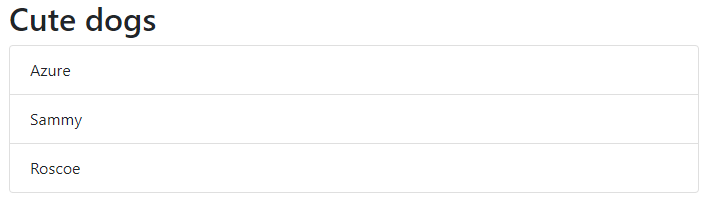

# Implementing Azure Functions for server-side code

The primary use case for Azure Static Web Apps is for full stack web applications where much of the logic is on the client. However, there will always be a need for server-side code. Azure Static Web Apps supports this through [Azure Functions](https://docs.microsoft.com/azure/azure-functions/functions-overview), a serverless offering from Azure. Azure Functions automatically scale eliminating the need to manage VMs and web servers, and offer [fantastic pricing](https://azure.microsoft.com/pricing/details/functions/) - up to 1,000,000 executions per month free!

## Adding Azure Functions to our project

Returning to Visual Studio Code, let's add Azure Functions.

- Start by creating a folder in your project called **api**
- Click the Azure logo on the left side of Visual Studio Code
  - If you don't see the logo, it might be hidden (click the ellipsis if one is visible), or you need to [install the Azure Functions extension](https://marketplace.visualstudio.com/items?itemName=ms-azuretools.vscode-azurefunctions)


- In the extension's window, click **New Project**
- Click **Browse** and choose the **api** folder you created earlier and click **OK**
  - This will become the root folder for all your functions
- Choose **JavaScript** as the language
- Choose **HTTP trigger** as the template
  - This will create a callable service, similar to an HTTP or REST endpoint
- Name the function **dogs** and click **Enter**
- Choose **Anonymous** as the **Authorization level**

The extension will create the function.

### Exploring the new files

Clicking on **Explorer** in Visual Studio Code will return you to the file view. You will notice the newly created **api** folder. A couple of folders and files to highlight:

- **package.json**
  - The standard file used to manage packages for Node.js projects
  - You can add any packages you wish to use for server-side code
- **local.settings.json**
  - A local repository of environmental variables for easy secret and key management
- **dogs/index.js**
  - Contains the code for the function

## Implementing our logic

Let's replace the boilerplate code in **dogs/index.js** with code to return the array of dogs.

``` javascript
// parameters:
//   context - access our function, including logging messages
//             and the response (res)
//   req - the request object (we won't use it here)
module.exports = async function (context, req) {
    context.log('Returning a list of dogs');

    context.res = {
        // status: 200, /* Defaults to 200 */
        // body is the payload of what we return
        body: {
            // add a property called dogs with our array
            dogs: [
                { name: 'Azure' },
                { name: 'Sammy' },
                { name: 'Roscoe' }
            ]
        },
        // flag the content type as JSON
        header: {
            'Content-Type': 'application/json'
        }
    };
}
```

### Breaking down our code

We start by logging a message. Then we set `context.res`, which is the object used to set how to respond to the request:

- `status` for the status message (200 by default)
- `body` for the payload, to which we add a property called `dogs` with our array
- `header` to set any additional information, such as the content type

## Starting the service locally for testing

Let's test our service! Return to the [Integrated Terminal](https://code.visualstudio.com/docs/editor/integrated-terminal) by hitting **Ctl-\`** (or **Cmd-\`**) and using the following commands:

``` bash
cd api
func host run
```

This will start your functions on **http://localhost:7071**. The output will display the link for your function at **http://localhost:7071/api/dogs**. You can follow this link to see the JSON result in your browser.

## Update your front-end code to use the back-end function

Let's update our code to call our new serverless function. Returning to **local-index.js**, update the `dogs` array to be empty. We'll populate it later in code.

``` javascript
const dogs = [
    // { name: 'Sammy' },
    // { name: 'Roscoe' },
    // { name: 'Artichoke' },
    // { name: 'Pookie' },
]
```

Under the new declaration (line 7), add a new function named `loadDogs`. This will call [`fetch`](https://developer.mozilla.org/en-US/docs/Web/API/Fetch_API/Using_Fetch) to retrieve the list from the function and populate our local array.

``` javascript
async function loadDogs() {
    // fetch to obtain the result of the call
    const result = await fetch('/api/dogs');
    // get the JSON object (the body)
    const body = await result.json()

    // loop through all items and push into our array
    for (let dog of body.dogs) {
        dogs.push(dog)
    }
}
```

Let's update `main` to call `loadDogs`

``` javascript
// inside existing main
async function main() {
    // new first line
    await loadDogs();
    displayDogs();
}
```

Our application is now setup to use our new function!

## Preparing to test locally

To test our application locally we'll need to do just a little more work. Right now we have two separate processes, one for our functions on port 7071, and one for our front-end on port 5500. Fortunately, [Live Server](https://marketplace.visualstudio.com/items?itemName=ritwickdey.LiveServer) can reroute our calls for us through a proxy.

- Stop Live Server by using the Command Pallette (**Ctl-Shift-P** or **Cmd-Shift-P**) and typing **Live Server: Stop Live Server**
- Open **.vscode/settings.json** and replace the JSON with the following

``` javascript
{
    "azureFunctions.deploySubpath": "api",
    "azureFunctions.postDeployTask": "npm install",
    "azureFunctions.projectLanguage": "JavaScript",
    "azureFunctions.projectRuntime": "~3",
    "debug.internalConsoleOptions": "neverOpen",
    "azureFunctions.preDeployTask": "npm prune",
    "liveServer.settings.proxy": {
        "enable": true,
        "baseUri": "/api",
        "proxyUri": "http://127.0.0.1:7071/api"
    }
}
```

> **NOTE:** These steps assume you've started with a new project. If you're using an existing project, just add the `liveServer.settings.proxy` to the end of the existing object.

- Restart Live Server
  - Open the Command Pallette (**Ctl-Shift-P** or **Cmd-Shift-P**)
  - Type **Live Server: Open with Live Server**

## Open the app locally

With our Live Server configured and our Azure Functions running, open a browser and navigate to **https://localhost:5500** or return to the existing tab and click refresh if you still have it open. You should see the list updated with Azure at the top!



## Next steps

Congratulations! You've now implemented everything locally!! Now it's time to [deploy our updates to Azure](5-deploy-updates.md).
